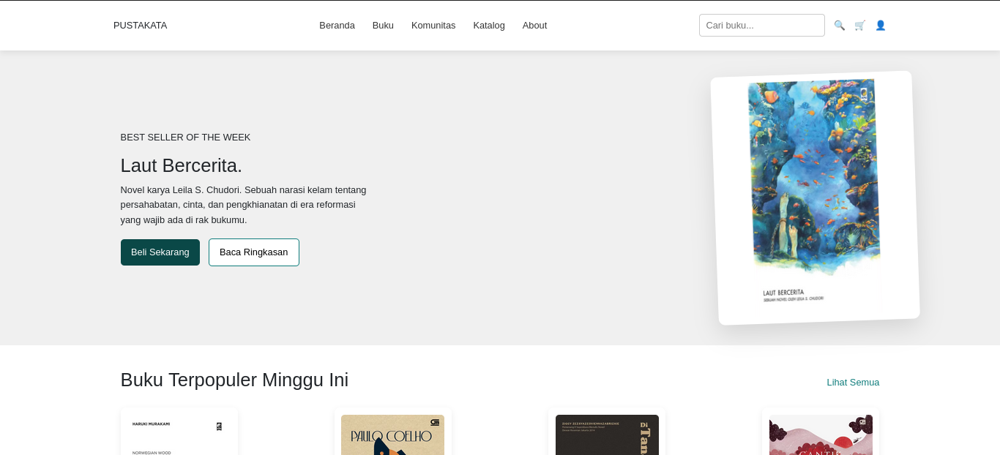
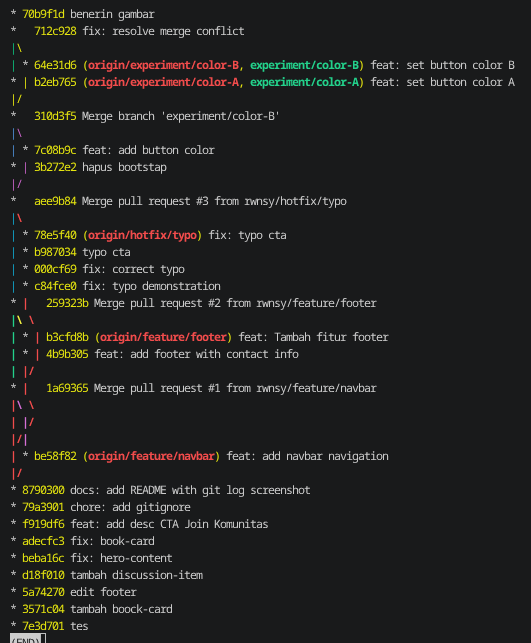
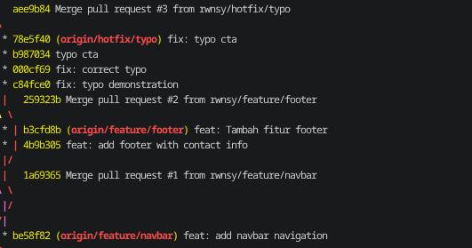
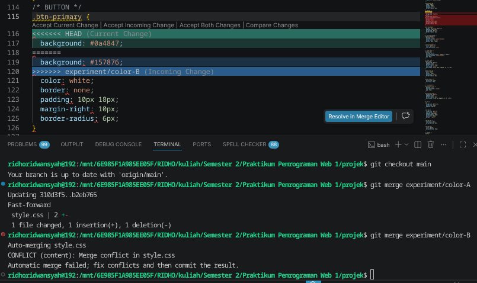
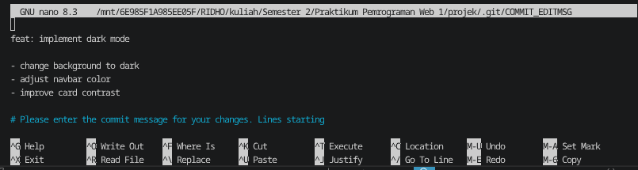
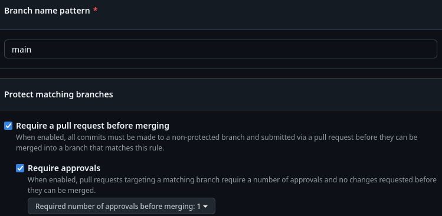

# 📘 Praktikum Git & GitHub — Pemrograman Web

Website komunitas buku yang dibangun sebagai tugas praktikum Git & GitHub.
Proyek ini mencakup halaman utama dengan navbar, hero section, book card,
discussion item, CTA, dan footer.

---

## 🚀 Cara Menjalankan

1. **Clone repository ini:**

   ```bash
   git clone https://github.com/rwnsy/praktikum-git-566168.git
   cd praktikum-git-566168
   ```

2. **Buka di browser:**
   - Buka file `index.html` langsung di browser, **atau**
   - Gunakan ekstensi **Live Server** di VS Code untuk auto-reload

3. **Tidak ada dependensi tambahan** yang perlu diinstall.

---

## 📸 Screenshot Website



---

## 📋 Git Log



## 🔧 Dokumentasi Perintah Git yang Digunakan

### ⚙️ Setup & Inisialisasi

| Perintah                               | Penjelasan                                              |
| -------------------------------------- | ------------------------------------------------------- |
| `git init`                             | Menginisialisasi repository Git baru di folder lokal    |
| `git clone <url>`                      | Menyalin repository dari GitHub ke komputer lokal       |
| `git config --global user.name "..."`  | Mengatur nama pengguna secara global untuk semua commit |
| `git config --global user.email "..."` | Mengatur email pengguna secara global                   |

---

### 📸 Stage & Commit

| Perintah                    | Penjelasan                                                 |
| --------------------------- | ---------------------------------------------------------- |
| `git status`                | Melihat status file saat ini (untracked, modified, staged) |
| `git add .`                 | Menambahkan semua perubahan ke staging area                |
| `git add <file>`            | Menambahkan file tertentu ke staging area                  |
| `git commit -m "pesan"`     | Menyimpan snapshot perubahan dengan pesan deskriptif       |
| `git log --oneline --graph` | Melihat riwayat commit dalam tampilan ringkas dan visual   |

Contoh commit yang dibuat pada project ini mengikuti konvensi **Conventional Commits**:

```bash
git commit -m "feat: add navbar navigation"
git commit -m "fix: resolve merge conflict"
git commit -m "chore: add gitignore"
git commit -m "docs: add README with git log screenshot"
```

---

### 🌿 Branching

| Perintah                      | Penjelasan                                         |
| ----------------------------- | -------------------------------------------------- |
| `git branch`                  | Melihat daftar branch yang ada                     |
| `git switch -c <nama-branch>` | Membuat branch baru dan langsung berpindah ke sana |
| `git switch <nama-branch>`    | Berpindah ke branch tertentu                       |
| `git branch -d <nama-branch>` | Menghapus branch yang sudah tidak dipakai          |
| `git push -u origin <branch>` | Mengirim branch lokal ke GitHub untuk pertama kali |

Branch yang dibuat pada project ini:

- `feature/navbar` — menambahkan navigasi halaman
- `feature/footer` — menambahkan footer dengan info kontak
- `hotfix/typo` — memperbaiki typo pada halaman utama
- `experiment/color-A` dan `experiment/color-B` — simulasi konflik merge



---

### 🔀 Merge & Konflik

| Perintah                     | Penjelasan                                                   |
| ---------------------------- | ------------------------------------------------------------ |
| `git merge <branch>`         | Menggabungkan branch lain ke branch aktif saat ini           |
| `git merge --no-ff <branch>` | Merge dengan paksa membuat merge commit                      |
| `git status`                 | Digunakan setelah konflik untuk melihat file yang bermasalah |
| `git add <file>`             | Menandai konflik sudah diselesaikan (mark as resolved)       |
| `git commit -m "..."`        | Menyelesaikan proses merge setelah konflik diatasi           |

Konflik terjadi saat branch `experiment/color-A` dan `experiment/color-B` keduanya mengubah baris CSS yang sama. Setelah `color-A` di-merge ke `main`, merge `color-B` menimbulkan konflik yang diselesaikan secara manual melalui VS Code (commit `712c928 fix: resolve merge conflict`).


---

### ♻️ Rebase

| Perintah                | Penjelasan                                                         |
| ----------------------- | ------------------------------------------------------------------ |
| `git rebase main`       | Memindahkan base branch saat ini ke ujung branch main              |
| `git rebase -i HEAD~3`  | Interactive rebase: mengedit, menggabungkan, atau menghapus commit |
| `git rebase --continue` | Melanjutkan proses rebase setelah konflik diselesaikan             |
| `git rebase --abort`    | Membatalkan proses rebase dan kembali ke kondisi semula            |

Interactive rebase digunakan pada branch `feature/dark-mode` untuk melakukan **squash** (menggabungkan 3 commit menjadi 1 commit bersih) sebelum di-merge ke `main`.


---

### ☁️ Remote & Sinkronisasi

| Perintah                      | Penjelasan                                                |
| ----------------------------- | --------------------------------------------------------- |
| `git remote add origin <url>` | Menghubungkan repository lokal ke repository GitHub       |
| `git push origin main`        | Mengirim commit dari lokal ke branch main di GitHub       |
| `git pull --rebase`           | Mengambil perubahan dari remote dan merebase branch lokal |
| `git fetch origin`            | Mengunduh perubahan dari remote tanpa langsung merge      |

---

### 🔒 Branch Protection

Branch `main` dilindungi dengan aturan berikut:

- ✅ Pull Request **wajib** sebelum merge
- ✅ Push langsung ke `main` **tidak diizinkan**
- ✅ Semua perubahan harus melalui PR dan review



---

## 📌 Issues

Berikut issues yang dibuat dan diselesaikan melalui Pull Request:

| #   | Judul                               | Status              |
| --- | ----------------------------------- | ------------------- |
| #1  | Tambahkan navigasi navbar           | ✅ Closed via PR #1 |
| #2  | Tambahkan footer dengan info kontak | ✅ Closed via PR #2 |
| #3  | Perbaiki typo pada halaman CTA      | ✅ Closed via PR #3 |

---

## 🏷️ Release

- **v1.0.0** — Rilis pertama project praktikum. Mencakup halaman utama lengkap dengan navbar, book cards, discussion section, CTA, dan footer. Semua tugas branching, konflik, dan rebase telah diselesaikan.
